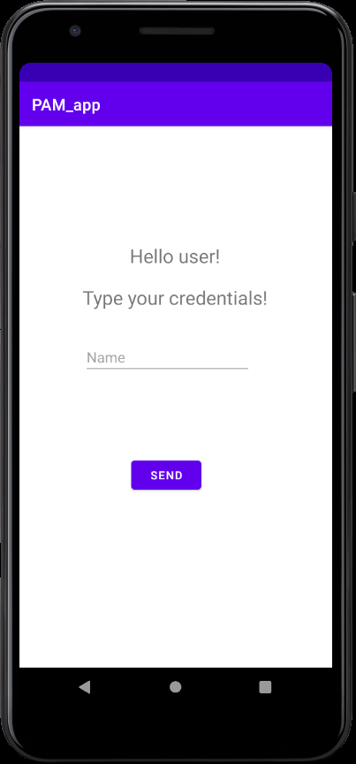
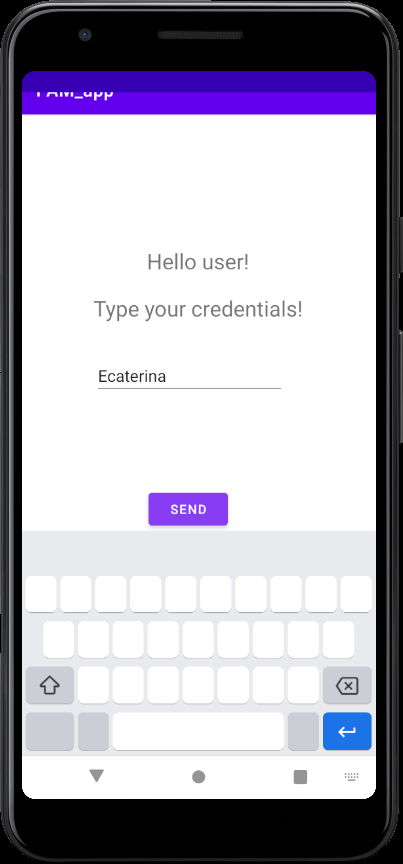
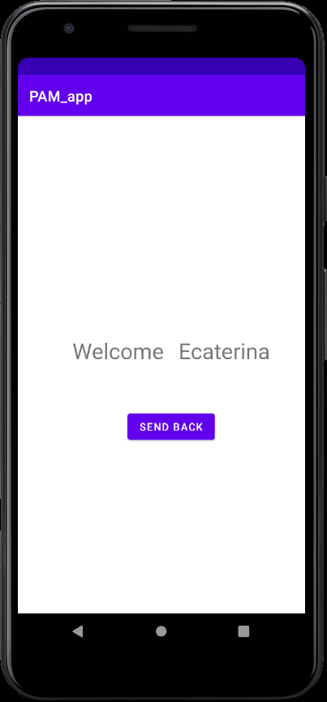
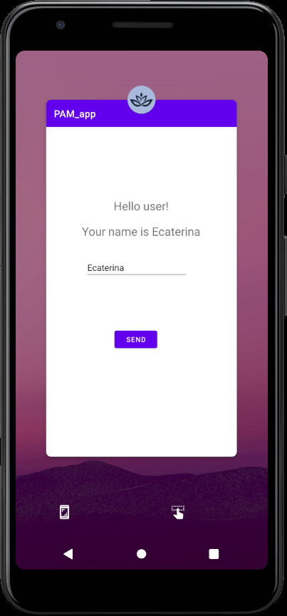

## Laboratory work nr1
# Laboratory Task:
For this laboratory work we had to:
* Init mobile application on selected platform
* Create at least 2 screens which transfer data from one screen to another
* Perform some data changes to data you received in screen No. 2 and pass it back to screen No. 1
* Add at least one active element on the screen, ex. button, text field and handle its action. Some not trivial action handling are welcome :)
* Change Icon of the app to custom one

# What I did:
1. So, I initiated a new android application using kotlin programming language.
2. For the second task I created 2 activities ```MainActivity.kt``` and ```SecondActivity.kt```
both with their own design. 

In the first screen I added a text field for the data that will be send and a button.
 

 
 I perform the action of sending data using an Intent object when the sent button is pressed
 ```kotlin
sendButton.setOnClickListener {
            val intent = Intent(this@MainActivity, SecondActivity::class.java)
            val name = nameEditText.text.toString()
            intent.putExtra("NAME", name)
            startActivityForResult(intent,1)
        }
```


After sending data, I need to get it in the second activity using intent functions and mainly 
```intent.getStringExtra()``` 
 and after getting the data I display it to the second screen.
 
 
 
 where appear Welcome message and the credentials introduced by the user. Also I need to perform 
 some modifications and send data back. So, I modified the string and using SEND BACK button 
 I send data back to the first screen. 
 
  
  
 where we can see the new message displayed "Your name is $name"
 
 3. Another task was to change the icon of the app we can se my icon below:
 
 