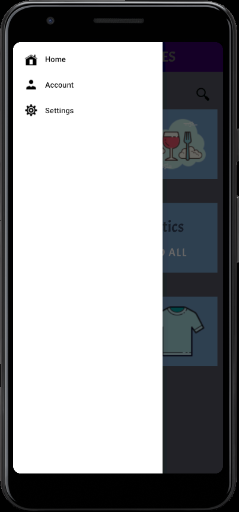
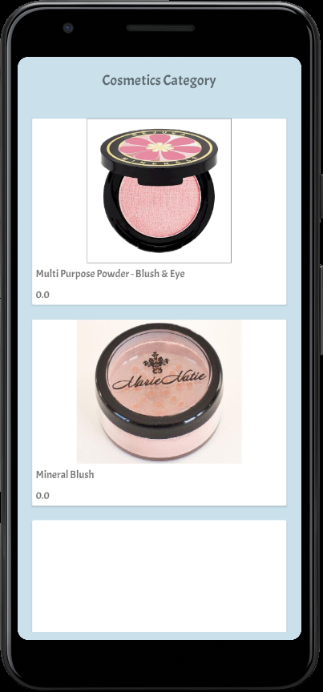
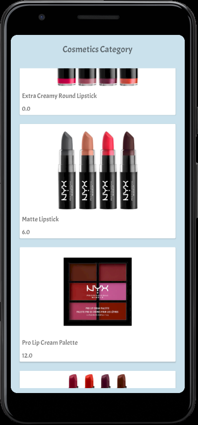

## Laboratory work Nr. 3
# Laboratory Task:
For this laboratory work we had to:
* Pick an API it could be public or private in case you have access to it. You could use your own 
API or TCP server (in case you a building chat). In case if you use Firebase or another serverless service, 
please add integration to Firebase but also implement connection to another API by performing standard HTTP requests.
* Implement at least 2 GET and 2 POST requests. At least 1 of your request should send data to API 
by request body in JSON format, but not by URL queries.
* On Android you have to use Retrofit(https://square.github.io/retrofit/) and kotlin coroutines on 
iOS you have to use Alamofire(https://github.com/Alamofire/Alamofire) and RxSwift(https://github.com/ReactiveX/RxSwift) 
* Add 2 more screens with implemented design, your app should have at least 5 screen, not just layout, 
but with implemented design.
* Add basic navigation component for in app navigation drawer menu(swipeable menu from left to right), 
or tab bar navigation(bottom bar with tabs) 
# What I did:
1. So, I selected an API corresponding to my application, and mainly the one for implementing another category of products 
2. Using kotlin coroutines and retrofit I created 2 GET and 2 POST requests
3. Finally I added an navigation component, an drawer menu 

I obtained the following result:

