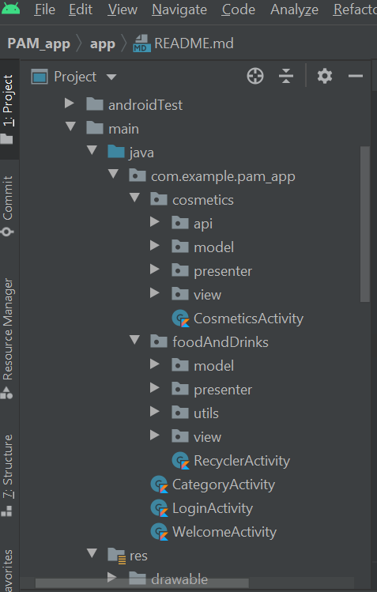

## Laboratory work Nr. 4
# Laboratory Task:
For this laboratory work we had to:
* Perform a research on several mobile app architectures, they are almost the same for both platforms. 
Most popular architecture are MVC, MVP, MVVM, RIBs https://github.com/uber/RIBs , VIPER mostly for 
iOS, Hexagonal architecture https://en.wikipedia.org/wiki/Hexagonal_architecture_(software) 
* Pick up an architecture which fits the best your project and refactor your code base to selected 
architecture. Your codebase should be refactored to follow idiomatic representation of selected architecture. 
You should follow principles of "Clean Architectures" 
https://blog.cleancoder.com/uncle-bob/2012/08/13/the-clean-architecture.html and 
"Clean code" https://www.investigatii.md/uploads/resurse/Clean_Code.pdf and please 
refactor your code to look clean and structured. Messy projects will not be evaluated.

# What I did:
1. So, for my project I selected  the MVP(Model View Presenter) architecture 
2. I changed the code to correspond to the pattern, and mainly the part responsible for api request, and presenting data in the recycler view, 
in such a way to have a model, an presenter and a view. For the view I created, also, an interface. 
3. Finally I structured the files into the packages.

I obtained the following structure of the project:

